# Setting up R and RStudio in Windows

## Installing R
* Open your browser and go to http://cran.r-project.org/  
* Click on `Download R for Windows`  

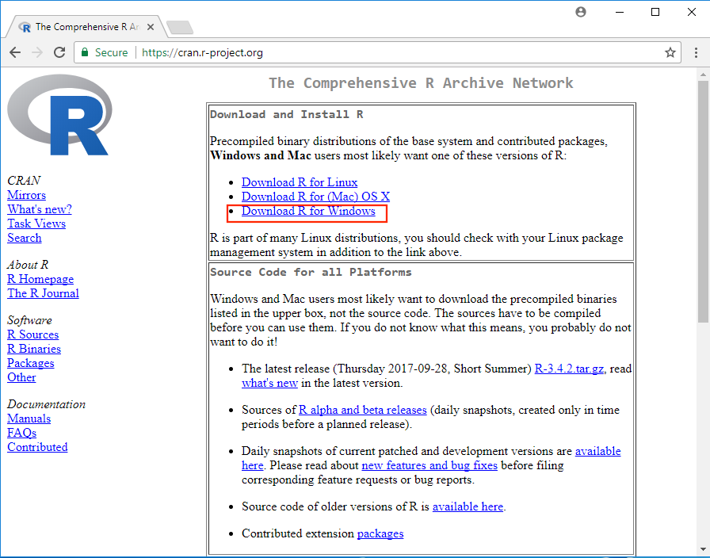

* Click on `base`  

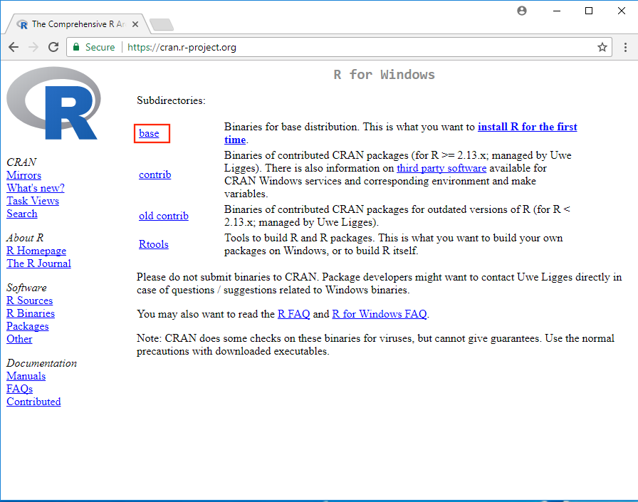

* Click on `Download R 3.1.2 for Windows`   

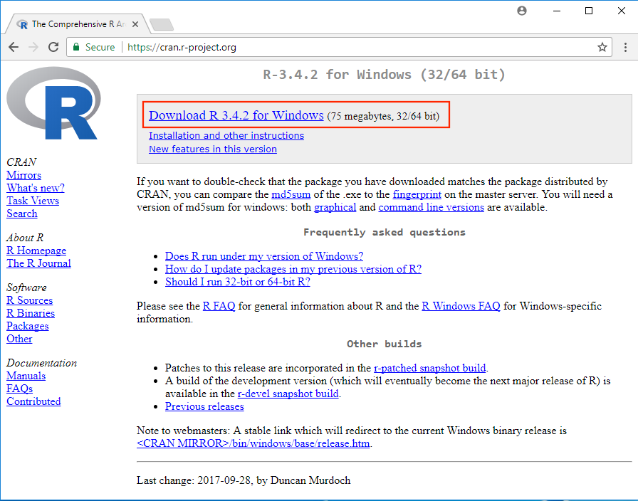

* Open and run the file you just downloaded `R-3.4.2-win.exe` 

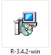

* There is no need to change the default installation!  

|  |  |  |
|:-------------:|:-------------:|:-------------:|
| 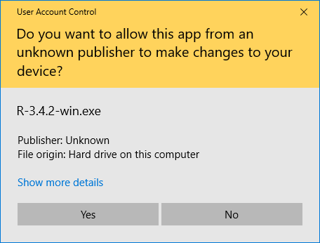 | 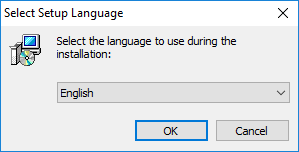| 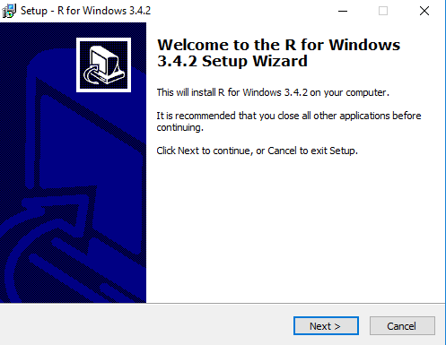 |
| **1** | **2** | **3** |
| 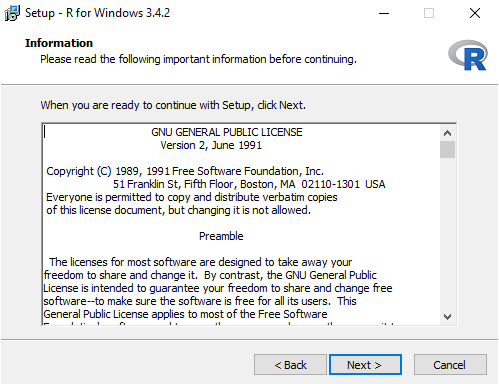 | 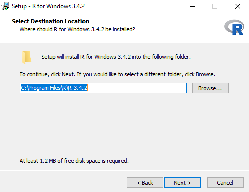| 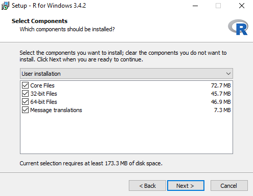 |
| **4** | **5** | **6** |
| 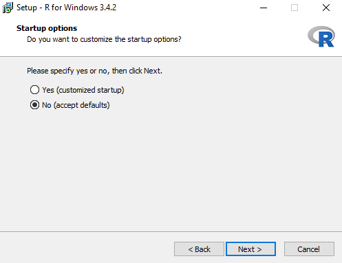 | 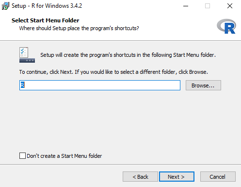| 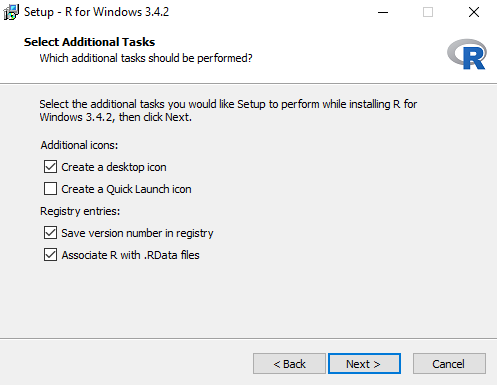 |
| **7** | **8** | **9** |
| 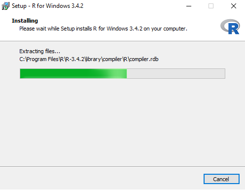 | 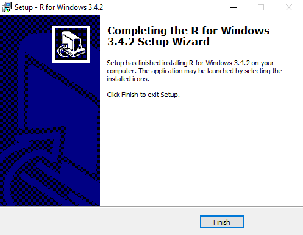| **DONE** |
| **10** | **11** | **12** |


## Installing RStudio  

* If you have already installed RStudio, before you skip this section check if you are using the right R version. Go to `Tools/Global Options`. Make you sure you have `R-3.4.2` under R version.  

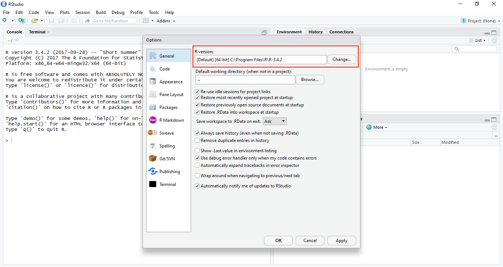 

* Go to http://www.rstudio.com/ and under `RStudio` click on `Download` .  

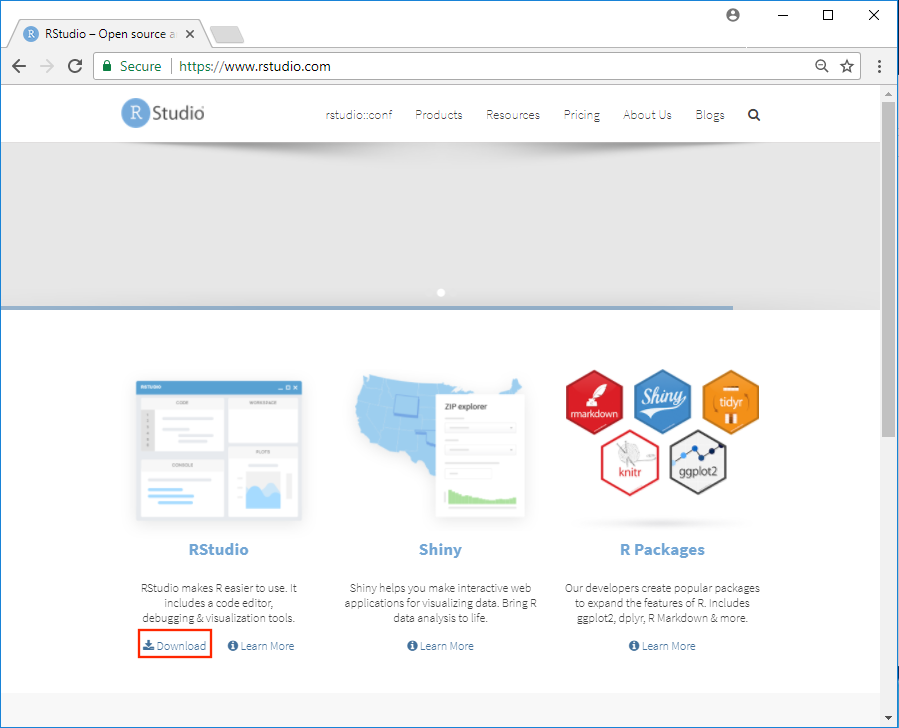

* Under `RStudio Desktop`, select `DOWNLOAD`  

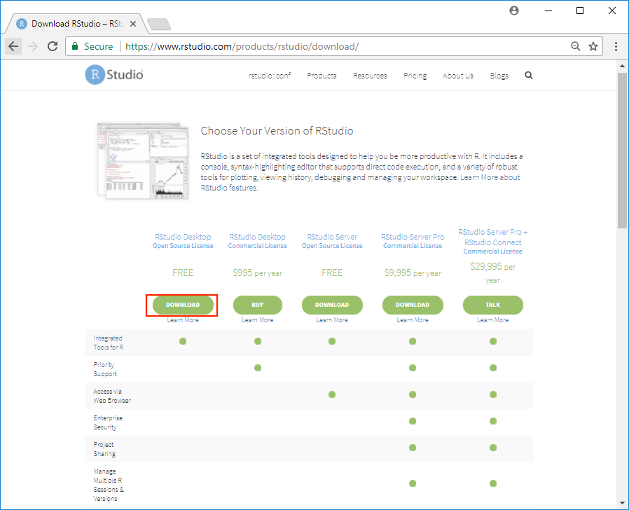

* Download the installer for Windows.  

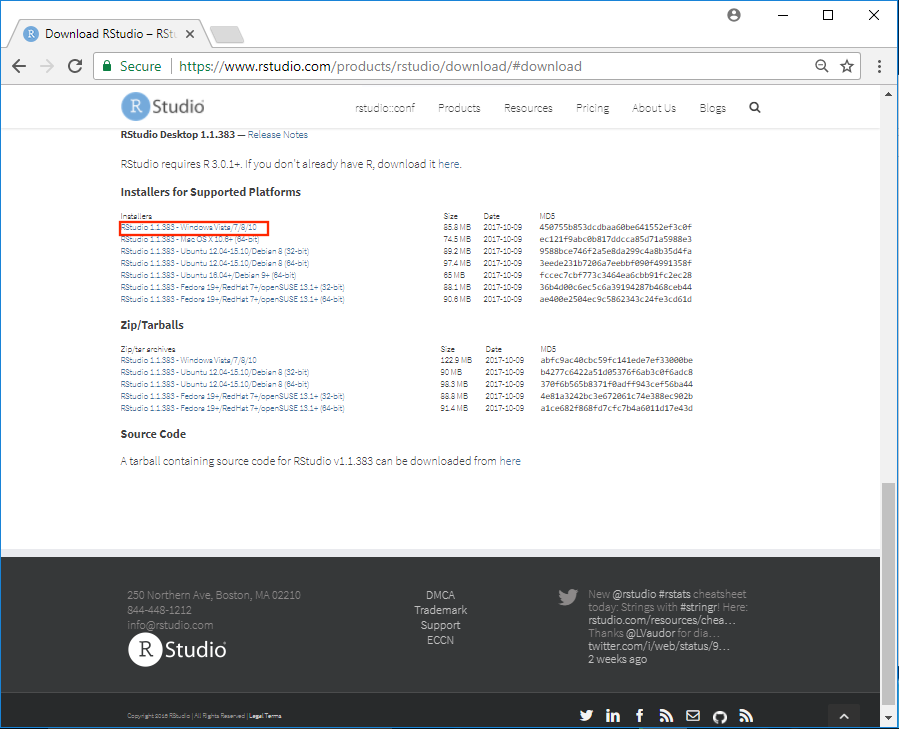

* Open and run the file you just downloaded `RStudio-1.1.383.exe` 

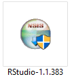

* You don't have to change any of the defaults for the installation  

|  |  |  |
|:-------------:|:-------------:|:-------------:|
|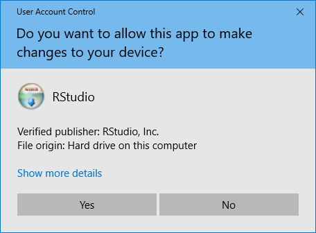 | 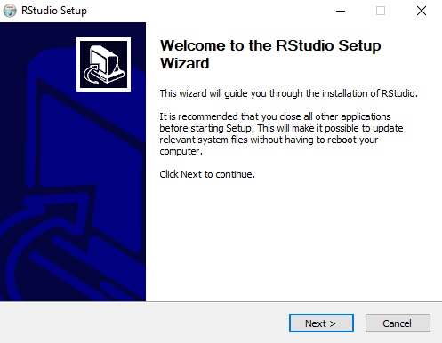|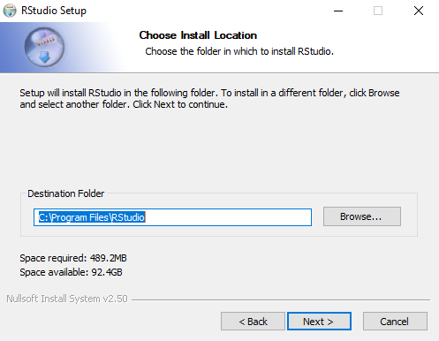|
|**1**|**2**|**3**|
|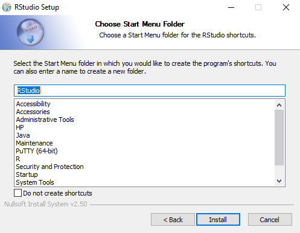 | 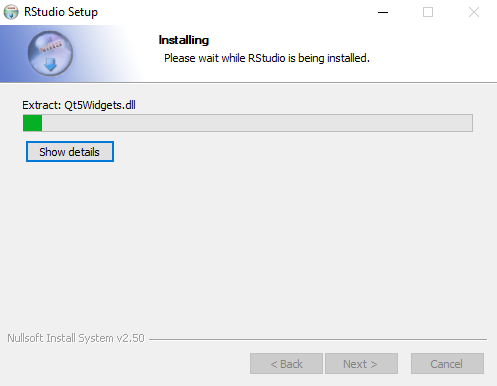| 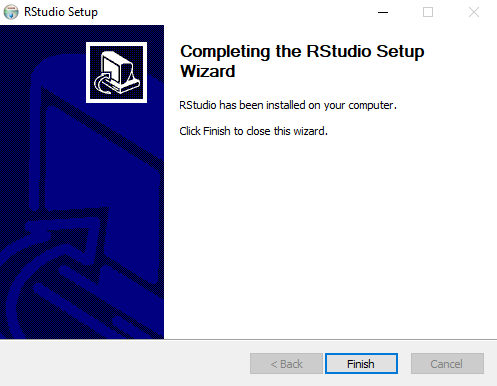 |
|**4**|**5**|**6**|


## Installing devtools
* Open Rstudio, in the **Files/Plots/Packages/Help** panel, select **Packages** and then click on **Install** 

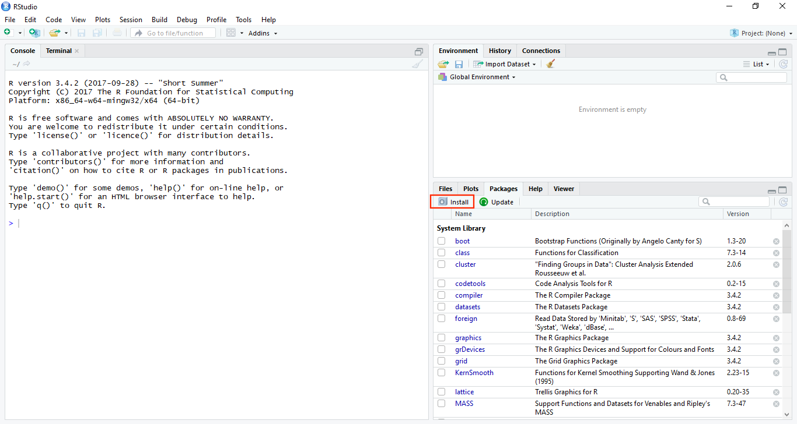

* Type `devtools` under **Packages**, make sure you spell the name of the package correctly. Then, click on **Install** 

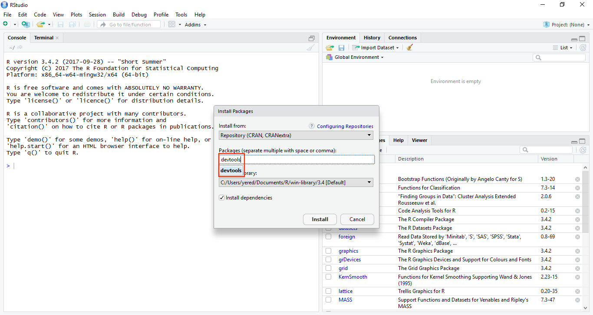  

* Alternatively, you can run the following command in the console.  

```
install.packages("devtools")
```
## Installing packages from GitHub
* We are ready to install R packages from GitHub 
* First we need to load the `devtools` package

```
library(devtools)
```

* Now we can install the `gapminder` package.  

```
install_github("jennybc/gapminder")
```

**License**  

 http://opensource.org/licenses/MIT
